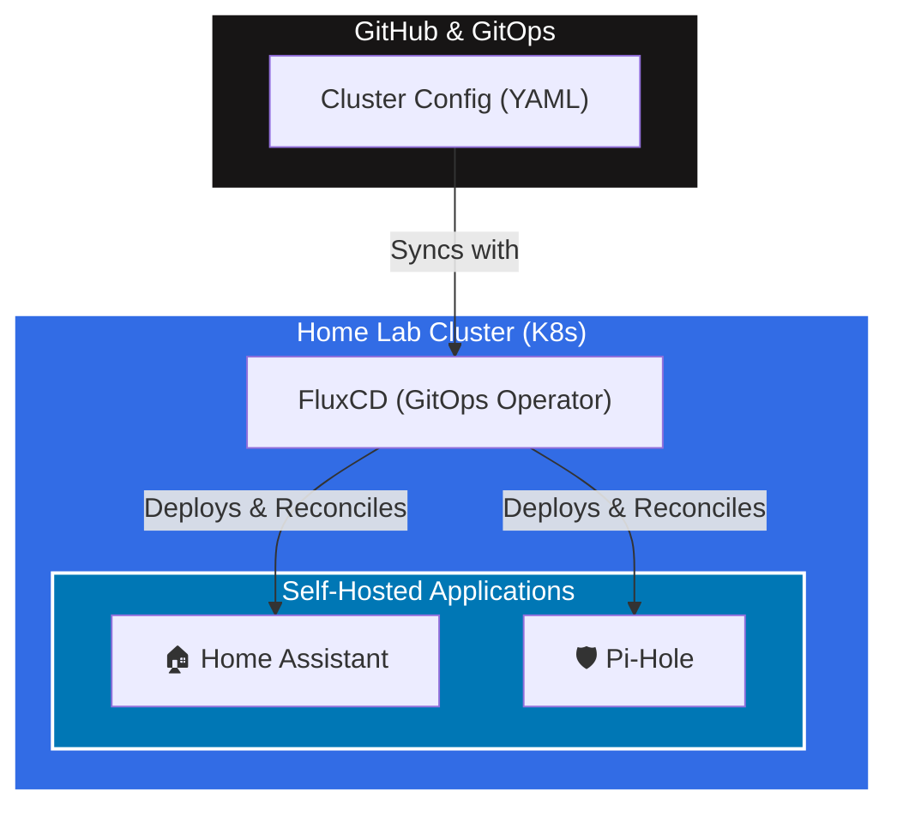

  <h1>Hi there, I'm Oren! 👋</h1>
  <h3>An ex-Windows Sys-Admin turned DevOps Engineer, and I never looked back.</h3>
   
  

 

  

 

<table align="center" width="100%">
  <tr>
    <td width="50%" valign="top">
      <h2>Who Am I :bird:</h2>
      
I have been working in IT for the last 20 years until I transitioned to being a DevOps Engineer. I am currently working as a Senior DevOps Engineer at a large FinTech company in Israel.

      
My responsibilities include researching new technologies, helping implement DevOps methodologies, and promoting the "DevOps Way" to other team members.

    </td>
    <td width="50%" valign="top">
      <h2>My Goal :goal_net:</h2>
      
My goal is to constantly improve my knowledge and experience as a DevOps engineer.

      
I created this GitHub account to showcase and document the various private projects I'm working on. It's a simple and effective way to incrementally improve my skills and share my journey with others.

    </td>
  </tr>
</table>

---

### 🔭 Currently Working On
- 🚀 [**My Self-Hosting Project**](https://github.com/users/orenzp/projects/1): Using Kubernetes and GitOps to set up infrastructure for hosted applications like [Home Assistant](https://www.home-assistant.io/) and [Pi-Hole](https://pi-hole.net/).
- 🌱 Learning **GitOps** using [FluxCD](https://github.com/fluxcd) by Weaveworks.

---

### 🏠 Home Lab Setup

---

### 🛠️ Tech Stack & Tools

  

---

### 📊 GitHub Stats

  
  

 

  

---

  

